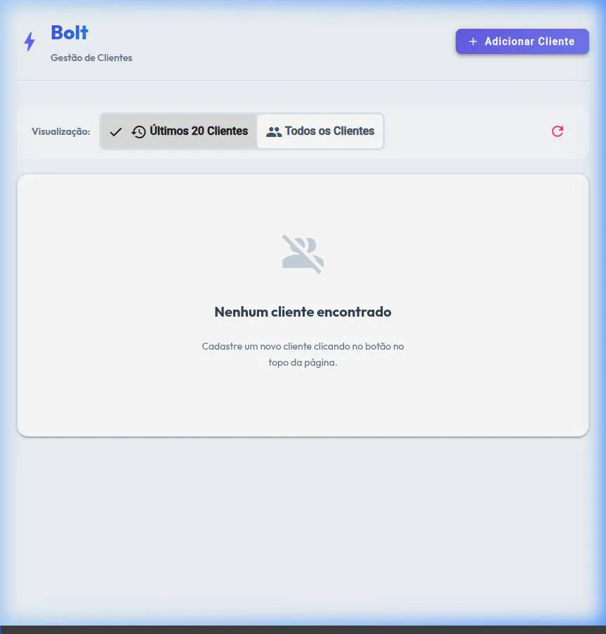
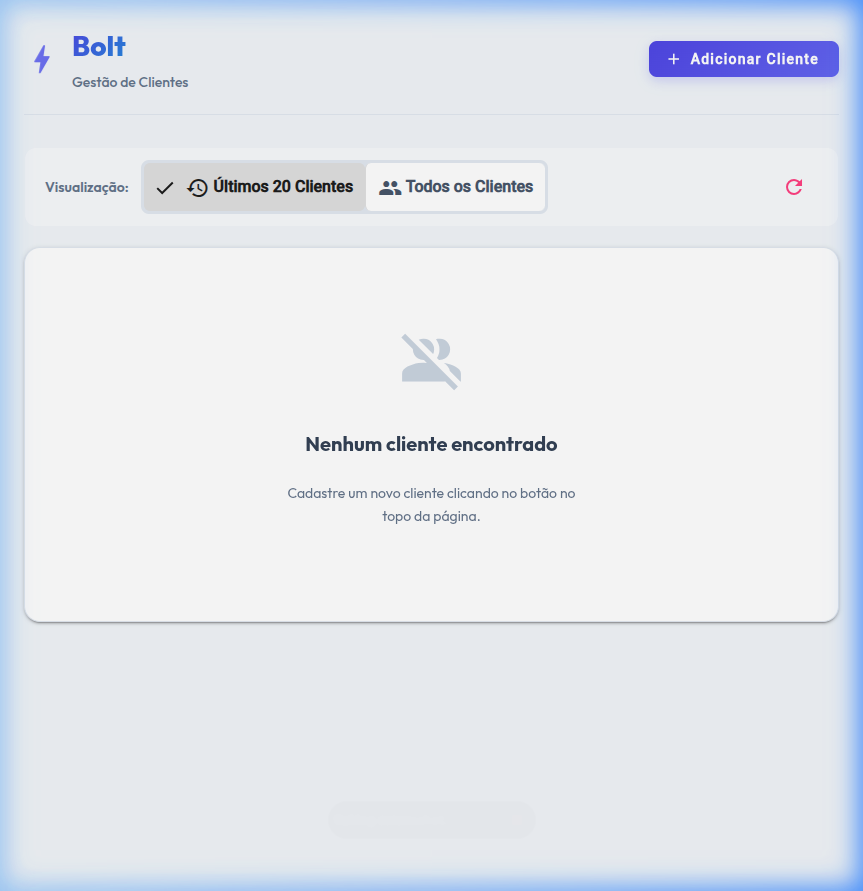
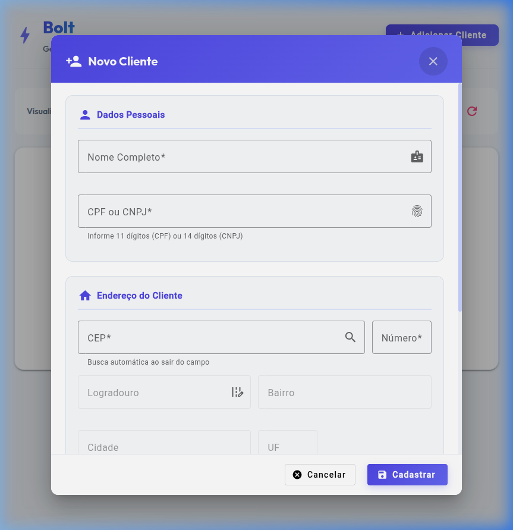
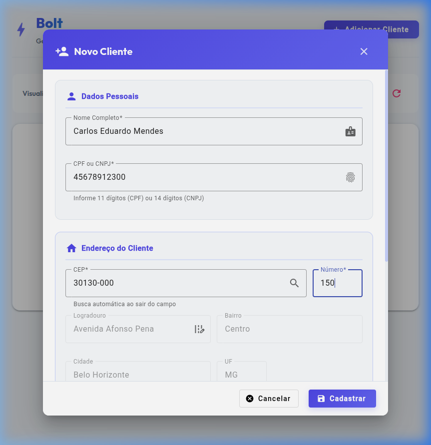
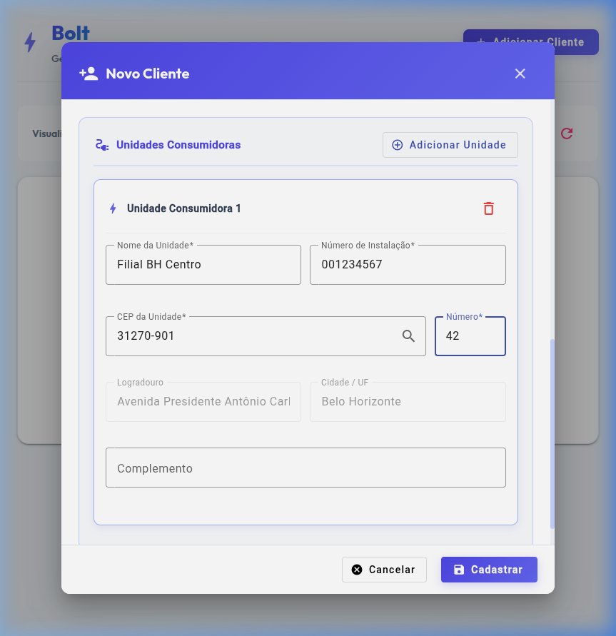
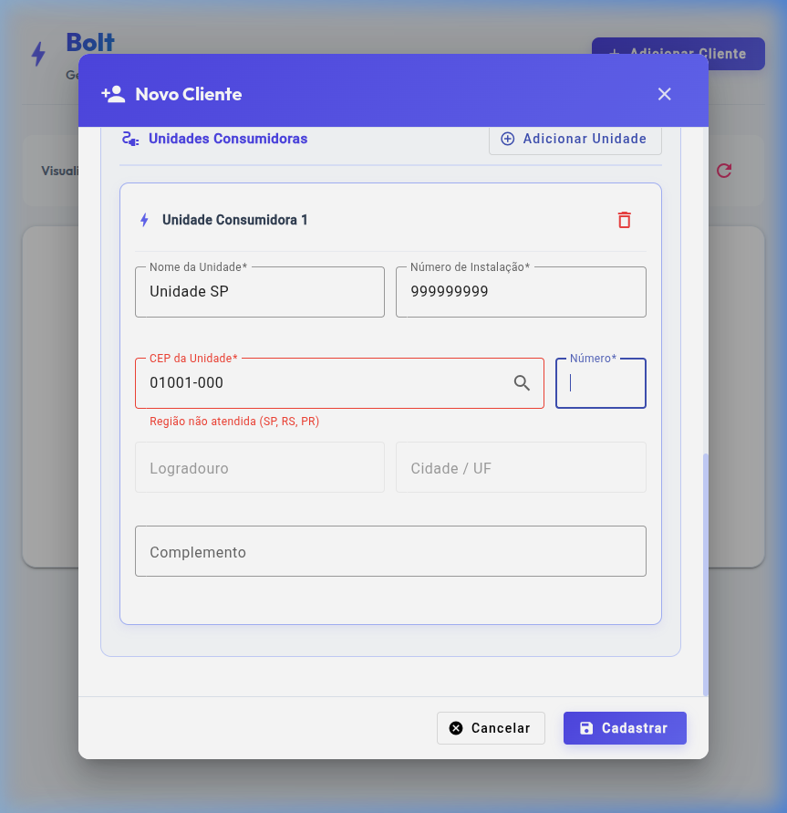
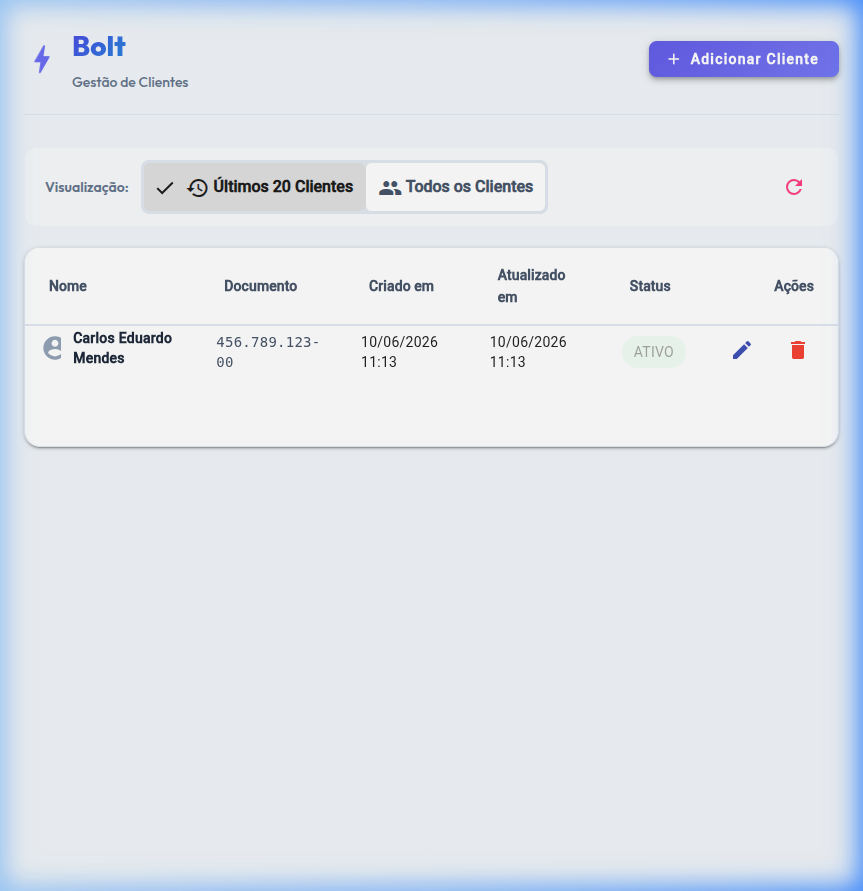

# 🔩 Bolt Client Manager

[](https://openjdk.org/)
[](https://spring.io/projects/spring-boot)
[](https://angular.io/)
[](#-banco-de-dados)
[](#-endpoints-da-api-rest-api-clients)
[](#-executando-com-docker-compose-diferencial)
[](#-seguran%C3%A7a)
[](https://opensource.org/licenses/MIT)

Uma solução full-stack moderna e profissional para o gerenciamento e cadastro de clientes, desenvolvida como solução ao **Desafio Técnico Bolt**. O sistema possui um backend robusto em **Spring Boot 3** integrado à API pública do **ViaCEP** e um frontend reativo e elegante em **Angular 17** com **Angular Material**.

---

## 📸 Demonstração Visual

Abaixo, veja o fluxo completo de funcionamento da aplicação (cadastro de clientes, autocomplemento de CEP, validação de regiões bloqueadas e listagem dinâmica):

### Execução de Testes Ponta a Ponta (E2E)


<details>
  <summary>🔍 Clique para ver capturas de tela detalhadas da interface</summary>
  
  #### Dashboard (Sem dados)
  

  #### Modal de Cadastro de Cliente
  

  #### Autocompletar CEP (ViaCEP)
  

  #### Adição Dinâmica de Unidades Consumidoras
  

  #### Validação Regional (Erro em estados não atendidos)
  

  #### Cliente Salvo e Atualizado no Dashboard
  
</details>

---

## 🏗️ Arquitetura do Projeto

O projeto adota uma separação clara de responsabilidades dividida entre API REST (Backend) e App Single Page (Frontend), além de ferramentas portáveis para garantir a compilação autônoma:

```
bolt-challenge/
├── backend/            # API REST (Spring Boot 3)
│   ├── src/main/java/com/bolt/clientmanager/
│   │   ├── controller/      # Controladores REST (endpoints CRUD)
│   │   ├── service/         # ClientService (regras) & ViaCepService (integração)
│   │   ├── repository/      # Interfaces Spring Data JPA
│   │   ├── model/           # Entidades JPA (Client, ConsumerUnit, Address)
│   │   ├── dto/             # Objetos de Transferência de Dados
│   │   ├── event/           # Eventos e Listeners de Mensageria (MG)
│   │   └── exception/       # Exceções personalizadas e Tratador Global
│   └── src/main/resources/  # Propriedades de configuração (.properties)
├── frontend/           # Interface SPA (Angular 17 + Angular Material)
│   └── src/app/
│       ├── components/      # Componentes UI (Listagem e Formulário)
│       ├── services/        # Consumo de API REST e ViaCEP
│       └── models/          # Modelagem de dados em TypeScript
├── tools/              # Ferramentas locais (JDK 17 + Maven 3.9.6)
└── docs/               # Ativos visuais e demonstrações
    └── assets/
└── sonar-project.properties # Configurações para análise estática do SonarQube
```

---

## 🛠️ Justificativa de Tecnologias & Decisões de Design

1. **Spring Boot 3 & Java 17:** Escolhidos pela robustez empresarial, suporte a recursos modernos de linguagem (como *Records* e *Pattern Matching*) e facilidade de configuração com o ecossistema Spring Data JPA.
2. **Angular 17 & Angular Material:** O Angular foi escolhido pela excelente separação de responsabilidades (HTML/TS/CSS), facilidade de testes unitários com Karma/Jasmine, e injeção de dependência nativa. O Angular Material foi adotado para garantir um design de altíssima qualidade (UX/UI consistente, transições suaves, tipografia refinada e responsividade).
3. **Soft Delete (Exclusão Lógica):** A propriedade `active` nas entidades evita a delegação direta no banco, preservando o histórico de clientes sem violar integridades referenciais.
4. **Acoplamento H2 / PostgreSQL:** O banco de dados padrão é o H2 em memória para facilidade de avaliação. No entanto, foram criados arquivos de profiles do Spring (`application-h2.properties` e `application-postgres.properties`) para que a aplicação possa migrar para PostgreSQL em segundos, necessitando apenas da injeção das variáveis de conexão.
5. **Mensageria com ApplicationEvents:** Para clientes do estado de Minas Gerais (MG), a publicação no tópico de análise é simulada utilizando `ApplicationEventPublisher` do Spring (disparando um `ClientMgAnalysisEvent` tratado por `ClientMgAnalysisListener`). Esta é uma solução elegante de baixo acoplamento interno que pode ser facilmente substituída por um broker real (ex. Kafka ou RabbitMQ) alterando apenas o Listener.
6. **Swagger / OpenAPI (Diferencial):** Integração do `springdoc-openapi` para expor uma documentação interativa completa dos endpoints da API, facilitando testes manuais rápidos da API direto pelo navegador.
7. **Docker & Docker Compose (Diferencial):** Containerização completa das aplicações backend e frontend utilizando Dockerfiles multi-stage (otimizando tamanho de imagem) e orquestração de rede com Docker Compose.
8. **Spring Security (Diferencial):** Segurança da API configurada com Basic Authentication via Spring Security. Para manter a experiência de usuário transparente e sem atrito para o avaliador, configuramos um **HttpInterceptor** reativo no Angular que injeta automaticamente o token de autorização nas requisições, deixando os endpoints da API protegidos externamente sem exigir formulário de login manual no frontend.
9. **Identidade Visual Bolt (Diferencial):** Integração da identidade de marca oficial da Bolt no cabeçalho e substituição do ícone padrão do Angular pelo favicon Swirl com fundo transparente, alinhando a estética da aplicação.
10. **Validação Matemática de CPF/CNPJ:** Implementação de validador reativo customizado com algoritmo real de dígitos verificadores para CPF e CNPJ, integrado com máscaras de digitação dinâmicas (`ngx-mask`).
11. **Avatares Dinâmicos Coloridos:** Substituição do ícone genérico cinza por avatares circulares que exibem a inicial do nome com cores consistentes baseadas em algoritmo de Hash, enriquecido com micro-animação de zoom suave no hover.
12. **Filtro de Clientes Persistente:** Correção do bug de desassociação do input de pesquisa no recarregamento da tabela e inclusão de um botão dedicado para limpeza rápida do filtro.

---

## 🚀 Como Executar o Projeto

O projeto contém binários locais em `tools/` para compilar o backend mesmo em sistemas sem o Java 17 ou Maven configurados globalmente.

### 🔌 Passo 1: Executar o Backend (Porta 8082)

```bash
cd backend
# Utiliza as ferramentas JDK 17 e Maven presentes no repositório
JAVA_HOME=../tools/jdk17 ../tools/maven/bin/mvn spring-boot:run -Dspring-boot.run.profiles=h2
```
* **API REST:** `http://localhost:8082`
* **Swagger UI (Documentação Interativa):** `http://localhost:8082/swagger-ui/index.html`
* **Console H2:** `http://localhost:8082/h2-console`
  * **JDBC URL:** `jdbc:h2:mem:clientedb`
  * **User:** `sa` | **Password:** *(em branco)*

### 💻 Passo 2: Executar o Frontend (Porta 4200)

Certifique-se de ter o Node.js instalado (v18 ou v20 recomendado).
```bash
cd frontend
npm install
npm run start
```
* **Aplicação Web:** `http://localhost:4200`

### 🐳 Executando com Docker Compose (Diferencial)

Se preferir rodar a aplicação completa sem instalar nenhuma dependência local (Node.js, Java, Maven, etc.), execute na raiz do projeto:

```bash
docker-compose up --build
```
* **Aplicação Web (Frontend):** `http://localhost` (Porta 80)
* **API REST (Backend):** `http://localhost:8082`
* **Swagger UI:** `http://localhost:8082/swagger-ui/index.html`
* **Console H2:** `http://localhost:8082/h2-console`
* **Credenciais de Segurança (HTTP Basic):** Usuário: `admin` | Senha: `admin123` (Injetadas automaticamente pelo interceptor do frontend)

---

## 🧪 Execução de Testes Automatizados

### Backend (JUnit 5 + Mockito)
Os testes de backend validam as principais regras de negócio: validação regional de estados proibidos, prevenção de documentos repetidos, disparo de eventos para MG e persistência do soft delete.
```bash
cd backend
JAVA_HOME=../tools/jdk17 ../tools/maven/bin/mvn test
```

### Frontend (Karma + Jasmine)
Os testes de frontend verificam o correto preenchimento e máscaras de formulários reativos, comportamento das requisições assíncronas do serviço de clientes e renderização adequada da tabela.
```bash
cd frontend
npx ng test --watch=false --browsers=ChromeHeadless
```

---

## 📋 Endpoints da API REST (`/api/clients`)

| Método | Endpoint | Parâmetros | Descrição |
|:---:|---|---|---|
| **GET** | `/api/clients` | `?recent=true` (opcional) | Lista clientes. Se `true`, retorna os últimos 20 em ordem decrescente |
| **GET** | `/api/clients/{id}` | - | Retorna os detalhes de um cliente por ID |
| **POST** | `/api/clients` | - | Cadastra um novo cliente com suas unidades consumidoras |
| **PUT** | `/api/clients/{id}` | - | Atualiza os dados cadastrais do cliente e de suas unidades |
| **DELETE**| `/api/clients/{id}` | - | Realiza a exclusão lógica do cliente (active = false) |

---

## 📈 Análise Estática com SonarQube

O projeto já está estruturado na raiz para análise contínua. Para rodar a verificação localmente:
```bash
cd backend
JAVA_HOME=../tools/jdk17 ../tools/maven/bin/mvn sonar:sonar \
  -Dsonar.host.url=http://localhost:9000 \
  -Dsonar.login=seu_token_aqui
```
